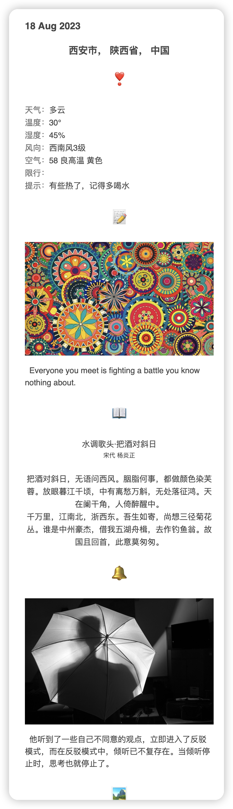

## email sender

每天定时发邮件给你关心的人, 内容包含天气, one 的一句话, 一句英语, 一首古诗

### 使用方式

```shell
# 1. 重命名 .env.example 为 .env
MAIL_USERNAME = 你的邮箱账号
MAIL_PASSWORD = 在 163 邮箱设置中获取授权密码
MAIL_HOST = smtp.163.com
MAIL_PORT = 25
# 【测试】 每分钟发一次 
MAIL_CRON = "0/1 * * * *"
MAIL_SUBJECT = 每日一暖, 温情一生
MAIL_FROM = 用户名<你的邮箱账号> # ep：xxx<xxx@163.com>
MAIL_TO = [{"email": "用户名<你的邮箱账号>", "local": "shaanxi/xian"}]

# 2.Build
go mod download
go build -o email-sender *.go

# 3. Run
./email-sender
```

效果图如下：



