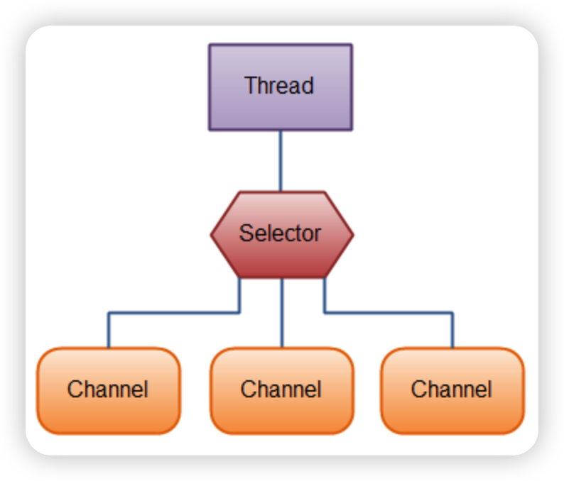

# NIO 

java.nio全称java non-blocking IO，是指JDK1.4 及以上版本里提供的新api（New IO） ，为所有的原始类型（boolean类型除外）提供缓存支持的数据容器，使用它可以提供非阻塞式的高伸缩性网络

参考：https://mp.weixin.qq.com/s/GfV9w2B0mbT7PmeBS45xLw?spm=a2c6h.12873639.article-detail.7.53064a610IxxwR

## 为什么使用NIO

在上面的描述中提到，是在JDK1.4以上的版本才提供NIO，那在之前使用的是什么呢？答案很简单，就是BIO(阻塞式IO)，也就是我们常用的IO流。

BIO的问题其实不用多说了，因为在使用BIO时，主线程会进入阻塞状态，这就非常影响程序的性能，不能充分利用机器资源。但是这样就会有人提出疑问了，那我使用多线程不就可以了吗？

但是在高并发的情况下，会创建很多线程，线程会占用内存，线程之间的切换也会浪费资源开销。

而NIO只有在连接/通道真正有读写事件发生时(事件驱动)，才会进行读写，就大大地减少了系统的开销。不必为每一个连接都创建一个线程，也不必去维护多个线程。

避免了多个线程之间的上下文切换，导致资源的浪费。

## NIO的三大核心

| NIO 的核心 | 对应的类或接口 | 应用  | 作用  |
| --- | --- | --- | --- |
| 缓冲区 | Buffer | 文件 IO / 网络 IO | 存储数据 |
| 通道  | Channel | 文件 IO / 网络 IO | 运输  |
| 选择器 | Selector | 网络 IO | 控制器 |


## 缓冲区 Buffer

Buffer是一个内存块。在NIO中，所有的数据都是用Buffer处理，有读写两种模式。所以NIO和传统的IO的区别就体现在这里。传统IO是面向Stream流，NIO而是面向缓冲区(Buffer)。

Buffer 的类型：

- ByteBuffer
- ShortBuffer
- IntBuffer
- CharBuffer
- LongBuffer
- FloatBuffer
- DoubleBuffer

一般我们常用的类型是ByteBuffer，把数据转成字节进行处理。实质上是一个byte[]数组。

```java
public abstract class ByteBuffer extends Buffer implements Comparable<ByteBuffer>{
    //存储数据的数组
    final byte[] hb;
    //构造器方法
    ByteBuffer(int mark, int pos, int lim, int cap, byte[] hb, int offset) {
        super(mark, pos, lim, cap);
        //初始化数组
        this.hb = hb;
        this.offset = offset;
    }
}
```

## 通道 Channel

常用的Channel有这四种：

- FileChannel，读写文件中的数据。
- SocketChannel，通过TCP读写网络中的数据。
- ServerSockectChannel，监听新进来的TCP连接，像Web服务器那样。对每一个新进来的连接都会创建一个SocketChannel。
- DatagramChannel，通过UDP读写网络中的数据。

> Channel本身并不存储数据，只是负责数据的运输。必须要和Buffer一起使用。

## Selector 选择器

Selector翻译成选择器，有些人也会翻译成多路复用器，实际上指的是同一样东西。

只有网络IO才会使用选择器，文件IO是不需要使用的。

选择器可以说是NIO的核心组件，它可以监听通道的状态，来实现异步非阻塞的IO。换句话说，也就是事件驱动。以此实现单线程管理多个Channel的目的。



**核心 API**

| API 方法名 | 作用  |
| --- | --- |
| Selector.open() | 打开一个选择器。 |
| select() | 选择一组键，其相应的通道已为 I/O 操作准备就绪。 |
| selectedKeys() | 返回此选择器的已选择键集。 |

